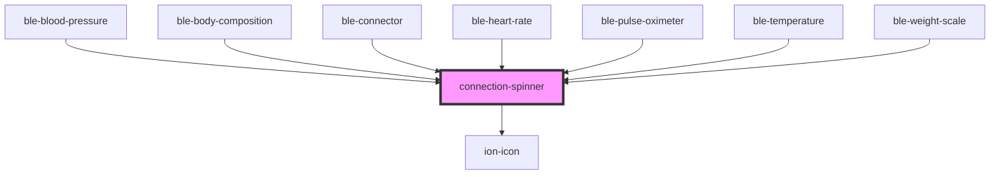

# connection-spinner

<!-- Auto Generated Below -->

## Properties

| Property    | Attribute   | Description | Type                                     | Default     |
| ----------- | ----------- | ----------- | ---------------------------------------- | ----------- |
| `direction` | `direction` |             | `"bottom" \| "left" \| "right" \| "top"` | `"right"`   |
| `label`     | `label`     |             | `string`                                 | `undefined` |

## Dependencies

### Used by

 - [ble-blood-pressure](..\..\blood-pressure)
 - [ble-body-composition](..\..\body-composition)
 - [ble-connector](..)
 - [ble-heart-rate](..\..\heart-rate)
 - [ble-pulse-oximeter](..\..\pulse-oximeter)
 - [ble-temperature](..\..\temperature)
 - [ble-weight-scale](..\..\weight-scale)

### Depends on

- ion-icon

### Graph

----------------------------------------------

*Built with [StencilJS](https://stenciljs.com/)*
