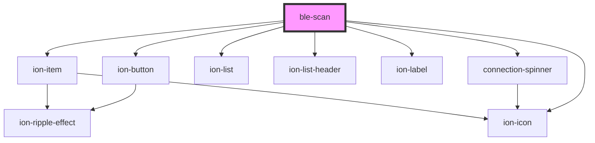

# ble-scan

<!-- Auto Generated Below -->

## Properties

| Property  | Attribute | Description | Type                    | Default     |
| --------- | --------- | ----------- | ----------------------- | ----------- |
| `service` | `service` |             | `BluetoothGATTServices` | `undefined` |

## Events

| Event     | Description | Type                                   |
| --------- | ----------- | -------------------------------------- |
| `error`   |             | `CustomEvent<Error>`                   |
| `success` |             | `CustomEvent<BluetoothGATTPeripheral>` |

## Dependencies

### Depends on

- ion-button
- [connection-spinner](ble-connection-spinner)
- ion-list
- ion-list-header
- ion-label
- ion-item
- ion-icon

### Graph

----------------------------------------------

*Built with [StencilJS](https://stenciljs.com/)*
