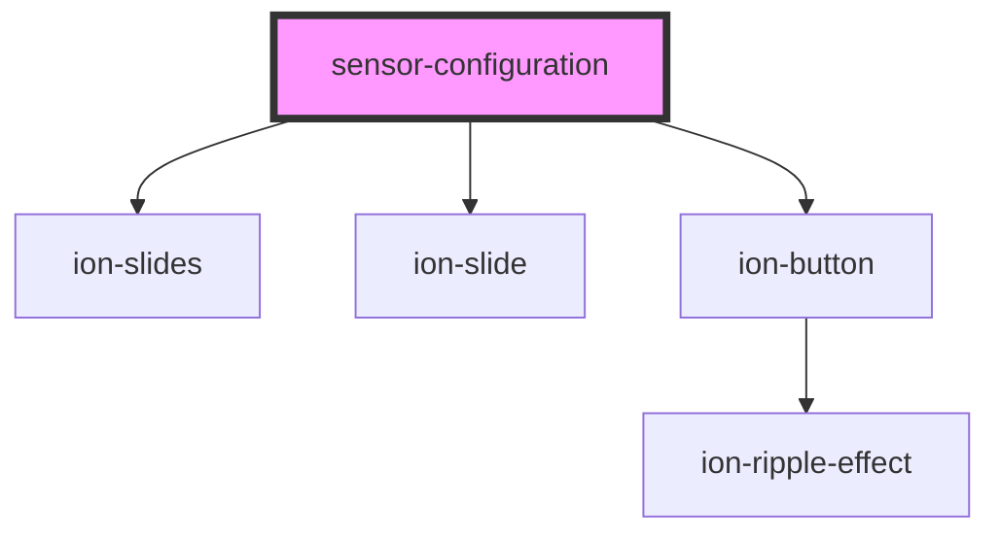

# sensor-configuration-modal

<!-- Auto Generated Below -->

## Methods

### `addConfig(toAdd: SensorUIConfig) => Promise<void>`

#### Returns

Type: `Promise<void>`

## Dependencies

### Depends on

- ion-slides
- ion-slide
- ion-button

### Graph

----------------------------------------------

*Built with [StencilJS](https://stenciljs.com/)*
